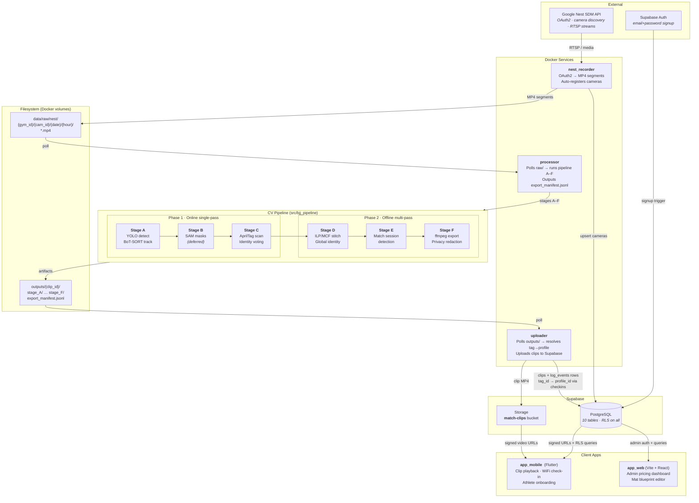

# Roll Tracker

Multi-service SaaS pipeline for BJJ gyms. Streams Nest camera footage, tracks
athletes via YOLO + BoT-SORT, anchors identity with AprilTags, stitches global
identities with ILP/MCF, and delivers per-athlete match clips through a mobile app.

## System Topology



## Monorepo Layout

```
roll_tracker/
├── src/bjj_pipeline/          # CV pipeline (Python 3.12, installable package)
│   ├── contracts/             # F0 data contracts: manifest, parquet, paths, validators
│   ├── stages/
│   │   ├── detect_track/      # A: YOLO + BoT-SORT → tracklets + detections
│   │   ├── masks/             # B: SAM masks (deferred, falls back to YOLO bbox)
│   │   ├── tags/              # C: AprilTag scheduling, scanning, identity voting
│   │   ├── stitch/            # D: MCF/ILP global identity (D0–D4, OR-Tools)
│   │   ├── matches/           # E: Match session detection
│   │   ├── export/            # F: ffmpeg clip cutting, redaction, manifest
│   │   └── orchestration/     # CLI entry point, stage registry, resume logic
│   └── config/, core/, eval/, tools/, viz/
│
├── services/
│   ├── nest_recorder/         # Docker: Nest API → MP4 segments + camera registration
│   ├── processor/             # Docker: polls raw/, wraps pipeline A–F
│   └── uploader/              # Docker: polls outputs/, uploads to Supabase
│
├── backend/supabase/supabase/
│   ├── config.toml
│   └── migrations/            # 21 SQL migrations (schema + RLS + triggers)
│
├── app_mobile/                # Flutter: athlete-facing clip viewer + WiFi check-in
├── app_web/                   # Vite + React: gym owner admin dashboard
├── configs/                   # Pipeline YAML configs + per-camera homography
├── docker-compose.yml         # Three-service orchestration
├── data/raw/nest/             # Raw MP4 segments (gitignored)
└── outputs/                   # Pipeline artifacts per clip (gitignored)
```

## Service Architecture

All services communicate through Supabase or the shared filesystem — no direct
service-to-service calls.

| Service | Input | Output | Trigger |
|---|---|---|---|
| **nest_recorder** | Nest SDM API (OAuth2) | MP4 → `data/raw/nest/` | Continuous |
| **processor** | `data/raw/nest/*.mp4` | `outputs/{clip_id}/stage_F/export_manifest.jsonl` | Polls every 30s |
| **uploader** | `export_manifest.jsonl` | Supabase DB rows + Storage upload | Polls outputs/ |

## Database Schema

10 tables, RLS on all. Key tables:

| Table | Role |
|---|---|
| `profiles` | Athletes. Auto-created on signup with `tag_id` (0–586 cycling sequence) |
| `clips` | Processed match clips with `fighter_a/b_tag_id` and resolved `profile_id` |
| `gym_checkins` | WiFi-based attendance. 3hr TTL. Used by uploader for tag→profile resolution |
| `cameras` | Auto-registered by nest_recorder on device discovery |
| `gyms` | Gym metadata, WiFi SSID/BSSID for auto check-in |
| `videos` | Raw video metadata |
| `log_events` | Audit trail |
| `gym_subscriptions` | Billing tier history |
| `homography_configs` | Per-camera calibration matrices |
| `gym_interest_signals` | Lead gen from onboarding flow |

Storage bucket: `match-clips` (private, RLS-gated signed URLs).

## Quick Start

```bash
# Pipeline (local, no Docker)
python3.12 -m venv .venv && source .venv/bin/activate
pip install -r requirements.txt
pip install --no-deps ultralytics boxmot
pip install -e .

python -m bjj_pipeline.stages.orchestration.cli run \
  --input data/raw/nest/cam03/2026-01-03/12/clip.mp4 \
  --camera cam03

# Docker services
cp .env.example .env   # fill Supabase + Nest credentials
docker compose up --build

# Local Supabase
cd backend/supabase/supabase && npx supabase start

# Web app
bash app_web/setup.sh && cd app_web && npm run dev

# Mobile app
cd app_mobile && ~/development/flutter/bin/flutter run
```

## Tech Stack

| Layer | Technology |
|---|---|
| CV pipeline | Python 3.12, YOLOv8 (ultralytics), BoT-SORT (boxmot), OR-Tools 9.12 |
| Identity | AprilTags 36h11 (~587 IDs), ILP/MCF stitching |
| Data format | Parquet (pyarrow), JSONL audit streams |
| Services | Docker (standalone containers, shared volumes) |
| Backend | Supabase (Postgres + Auth + Storage + Realtime) |
| Mobile | Flutter + supabase_flutter + video_player + geolocator |
| Web | Vite + React + react-router-dom + @supabase/supabase-js |
