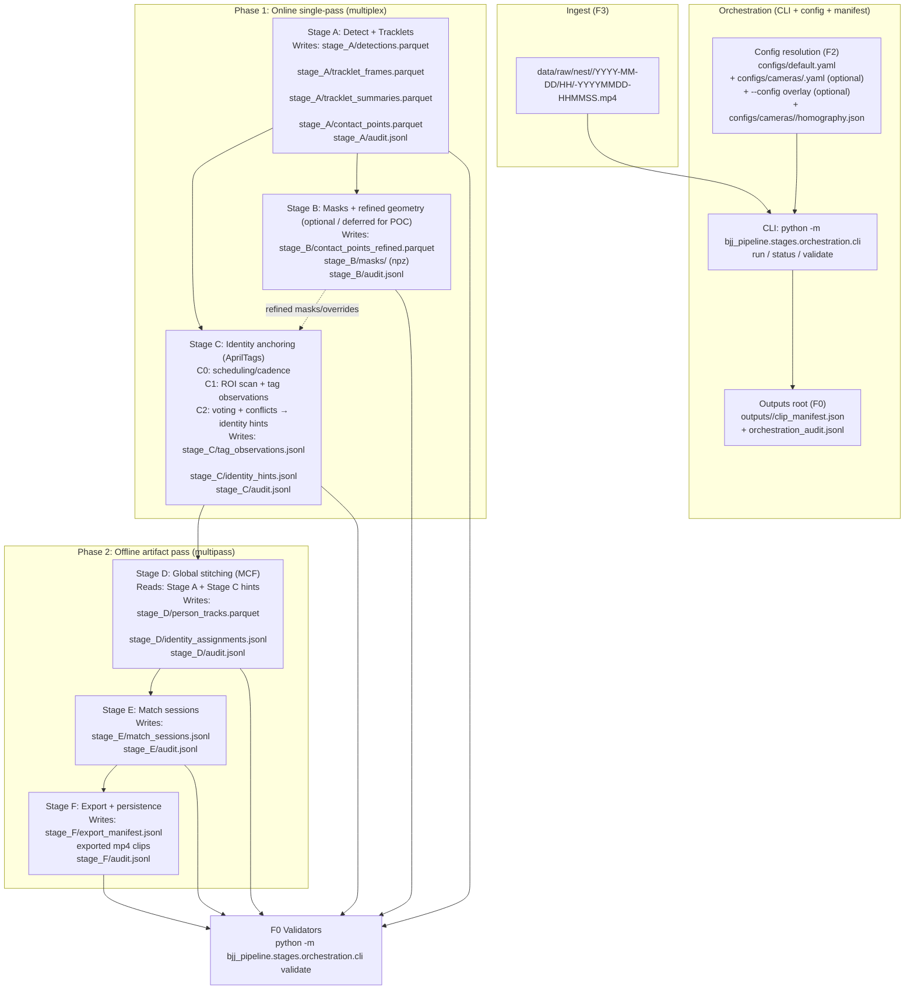

# roll_tracker

Offline-first video processing pipeline for BJJ practice clips.

## Project Flow (End-to-End)

```mermaid
flowchart TD
	%% --------------------
	%% Inputs + Orchestration
	%% --------------------
	subgraph Ingest["Ingest (F3)"]
		RawVideo["data/raw/nest/<camera_id>/YYYY-MM-DD/HH/<camera_id>-YYYYMMDD-HHMMSS.mp4"]
	end

	subgraph Orchestration["Orchestration (CLI + config + manifest)"]
		CLI["CLI: python -m bjj_pipeline.stages.orchestration.cli\nrun / status / validate"]
		Config["Config resolution (F2)\nconfigs/default.yaml\n+ configs/cameras/<camera_id>.yaml (optional)\n+ --config overlay (optional)\n+ configs/cameras/<camera_id>/homography.json"]
		Manifest["Outputs root (F0)\noutputs/<clip_id>/clip_manifest.json\n+ orchestration_audit.jsonl"]
	end

	RawVideo --> CLI
	Config --> CLI
	CLI --> Manifest

	%% --------------------
	%% Phase 1: Online pass
	%% --------------------
	subgraph Online["Phase 1: Online single-pass (multiplex)"]
		A["Stage A: Detect + Tracklets\nWrites: stage_A/detections.parquet\n        stage_A/tracklet_frames.parquet\n        stage_A/tracklet_summaries.parquet\n        stage_A/contact_points.parquet\n        stage_A/audit.jsonl"]

		B["Stage B: Masks + refined geometry (optional / deferred for POC)\nWrites: stage_B/contact_points_refined.parquet\n        stage_B/masks/ (npz)\n        stage_B/audit.jsonl"]

		C["Stage C: Identity anchoring (AprilTags)\nC0: scheduling/cadence\nC1: ROI scan + tag observations\nC2: voting + conflicts → identity hints\nWrites: stage_C/tag_observations.jsonl\n        stage_C/identity_hints.jsonl\n        stage_C/audit.jsonl"]

		A --> C
		A --> B
		B -. "refined masks/overrides" .-> C
	end

	%% --------------------
	%% Phase 2: Offline pass
	%% --------------------
	subgraph Offline["Phase 2: Offline artifact pass (multipass)"]
		D["Stage D: Global stitching (MCF)\nReads: Stage A + Stage C hints\nWrites: stage_D/person_tracks.parquet\n        stage_D/identity_assignments.jsonl\n        stage_D/audit.jsonl"]
		E["Stage E: Match sessions\nWrites: stage_E/match_sessions.jsonl\n        stage_E/audit.jsonl"]
		F["Stage F: Export + persistence\nWrites: stage_F/export_manifest.jsonl\n        exported mp4 clips\n        stage_F/audit.jsonl"]
		D --> E --> F
	end

	C --> D

	%% --------------------
	%% Validation
	%% --------------------
	Validate["F0 Validators\npython -m bjj_pipeline.stages.orchestration.cli validate"]
	A --> Validate
	B --> Validate
	C --> Validate
	D --> Validate
	E --> Validate
	F --> Validate
```

