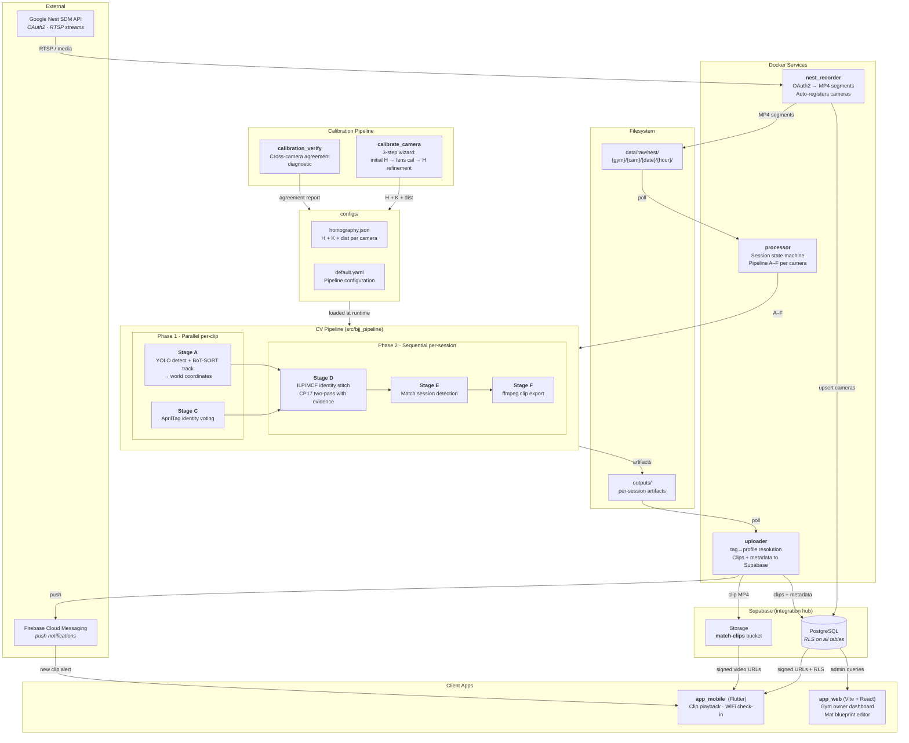

# Roll Tracker

Automated match clip delivery for BJJ gyms. Ceiling-mounted cameras watch the mat,
the system tracks athletes through occlusions and across camera views, and personalized
highlight clips arrive on each athlete's phone minutes after class ends.

## How It Works

1. **Cameras watch the mat.** Nest cameras stream continuously. The system records MP4
   segments and auto-registers each camera to the gym's account.

2. **The pipeline identifies athletes through occlusions.** YOLO detects bodies,
   BoT-SORT tracks them frame-to-frame, and AprilTags on rashguards anchor identity.
   When athletes disappear behind training partners or roll off one camera's view onto
   another's, a min-cost flow solver stitches fragmented tracklets back together into
   continuous identities — even resolving who-is-who across multiple camera angles by
   combining tag sightings with world-coordinate proximity evidence.

3. **Personalized clips arrive on the phone.** The system detects match engagement
   windows, cuts clips with ffmpeg, uploads to Supabase storage, and pushes
   notifications. Athletes open the app and see their rolls.

## System Architecture



**Principle:** All services communicate through Supabase or the shared filesystem — no
direct service-to-service calls.

## Pipeline Stages

| Stage | Phase | What it does | Key I/O |
|-------|-------|-------------|---------|
| **A** detect_track | 1 (parallel) | YOLO detection + BoT-SORT tracking. Projects contact points to world coordinates via `project_to_world()` with lens undistortion. | → tracklet_frames.parquet, detections.parquet |
| **B** masks | 1 | SAM segmentation (deferred for POC, YOLO bbox fallback) | — |
| **C** tags | 1 (parallel) | AprilTag 36h11 scanning with scheduling/cadence control, identity voting | → identity_hints.jsonl |
| **D** stitch | 2 (sequential) | ILP/MCF solver (OR-Tools) stitches tracklets into global person identities. Two-pass: Pass 1 independent solve → cross-camera evidence → Pass 2 re-solve with corroboration. | → person_tracks.parquet, identity_assignments.jsonl |
| **E** matches | 2 | Two-layer engagement detection: proximity seeds + hysteresis. Buzzer gate optional. | → match_sessions.jsonl |
| **F** export | 2 | ffmpeg clip cutting per match per athlete. Writes export manifest. | → clips/, export_manifest.jsonl |

**Phase 1** runs A+C in parallel per clip (multiplex_AC). **Phase 2** runs D→E→F
sequentially per session after all cameras complete Phase 1.

## Calibration Stack

Each camera undergoes a 3-step calibration via `calibrate_camera.py`:

1. **Initial homography** — User places 4 anchor corners mapping mat blueprint to camera
   view. Produces H (mat→img).
2. **Lens calibration** — Automated edge detection along projected mat polylines. Powell
   optimization of collinearity cost (f, k1, k2). Produces K + dist coefficients.
3. **H refinement** — Canny+Hough line detection on undistorted frame, matched to projected
   polylines. RANSAC homography from dense world↔pixel correspondences. Iterative
   (max 3 rounds), converges at <0.1px mean reprojection change.

**Results:** Sub-centimeter cross-camera agreement (9mm worst-case pairwise deviation,
verified by `calibration_verify.py`). 1.0-1.3px reprojection error across 3 cameras.

**Daily maintenance:** `cp19_recalibrate.py` re-runs Phase 3 using existing anchor
correspondences + calibration test video, compensating for any camera drift.

## Session Processing

The processor groups clips into sessions using a gym class schedule (`SCHEDULE_JSON`):

1. **Phase 1 (parallel):** Each clip processed independently through A+C. Sentinel files
   track per-camera completion.
2. **Session readiness gate:** When all cameras have completed Phase 1 and the class
   window has elapsed, the session is marked ready.
3. **Phase 2 (sequential):** Per-camera D+E runs. Cross-camera identity merge via
   union-find on shared tag observations. CP17 two-pass ILP re-solve with tag
   corroboration (10x penalty for fragmenting a cross-camera-verified identity) and
   coordinate evidence (world-space proximity agreement across camera pairs).
4. **Export:** Per-camera clip cutting, manifest merge, upload.

## Product Vision

**Three-sided product:**

- **Gym owners:** Monthly subscription. Web dashboard for camera management, mat blueprint
  editing, calibration monitoring, and coverage heatmaps. Rashguard merchandise with
  embedded AprilTags (gym revenue + identity anchor).
- **Athletes:** Free mobile app. Clip playback, gym finder, WiFi-based auto check-in,
  referral program.
- **System:** Three Docker services (recorder, processor, uploader), Supabase as the
  integration hub (Postgres + Auth + Storage + Realtime), Firebase for push notifications.

## Monorepo Layout

```
roll_tracker/
├── src/bjj_pipeline/          # CV pipeline (Python 3.12, installable package)
│   ├── contracts/             # F0: manifest, parquet, paths, projection, validators
│   ├── stages/                # A detect_track, B masks, C tags, D stitch, E matches, F export
│   └── config/, core/, tools/, viz/
│
├── src/calibration_pipeline/  # Gym setup: lens cal, H refinement, mat line detection
│
├── services/
│   ├── nest_recorder/         # Docker: Nest API → MP4 segments + camera registration
│   ├── processor/             # Session state machine, wraps pipeline A–F
│   └── uploader/              # Polls outputs/, uploads to Supabase
│
├── backend/supabase/supabase/ # Migrations (23), config.toml
├── app_mobile/                # Flutter: athlete clip viewer + WiFi check-in
├── app_web/                   # Vite + React: gym owner dashboard
├── configs/                   # default.yaml, per-camera homography.json
├── docs/                      # Calibration guide, decisions archive, audits
└── .claude/rules/             # Domain-specific context for Claude Code CLI
```

## Tech Stack

| Layer | Technology |
|---|---|
| CV pipeline | Python 3.12, YOLOv8 (ultralytics), BoT-SORT (boxmot), OR-Tools 9.12 (ILP/MCF) |
| Identity | AprilTags 36h11 (~587 IDs), cross-camera tag + coordinate corroboration |
| Calibration | OpenCV (homography, undistortion), scipy (Powell optimizer), RANSAC |
| Data format | Parquet (pyarrow), JSONL audit streams |
| Services | Docker (standalone containers, shared volumes) |
| Backend | Supabase (Postgres + Auth + Storage + Realtime) |
| Mobile | Flutter + supabase_flutter + video_player + geolocator |
| Web | Vite + React + react-router-dom + @supabase/supabase-js |
| Notifications | Firebase Cloud Messaging (FCM) |

## Quick Start

```bash
# Install
python3.12 -m venv .venv && source .venv/bin/activate
pip install -r requirements.txt
pip install --no-deps ultralytics boxmot && pip install -e .

# Run pipeline on a clip
python -m bjj_pipeline.stages.orchestration.cli run \
  --input data/raw/nest/cam03/2026-01-03/12/clip.mp4 --camera cam03

# Docker services
cp .env.example .env  # fill Supabase + Nest credentials
docker compose up --build

# Local Supabase
cd backend/supabase/supabase && npx supabase start
```

See `.claude/rules/commands.md` for full command reference.
See `docs/calibration_guide.md` for calibration workflow.

## Current Status

- **Pipeline:** E2E verified. 3-camera session pipeline validated (35/36 clips).
- **Calibration:** Sub-centimeter cross-camera agreement (9mm). CP19 unified wizard.
- **Identity:** Tag corroboration (CP17 Tier 1) + coordinate evidence (Tier 2, disabled by default).
- **Undistortion:** All 9 pipeline code paths audited correct. See `docs/undistortion_audit.md`.
- **Apps:** Flutter tested on Pixel 7 Pro. Web app functional draft (mat editor + admin pricing).
- **Deployment:** Native Mac via `run_local.sh`. Docker pending for Linux.
- **Supabase:** 23 migrations applied. 10 tables, RLS on all.

## Database

PostgreSQL via Supabase. 10 tables with RLS, storage bucket `match-clips` with signed URLs.
See `backend/supabase/supabase/migrations/` for schema.
